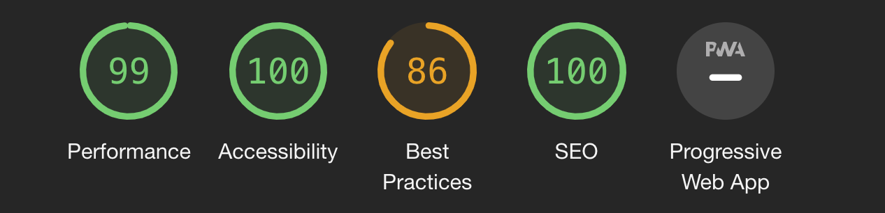
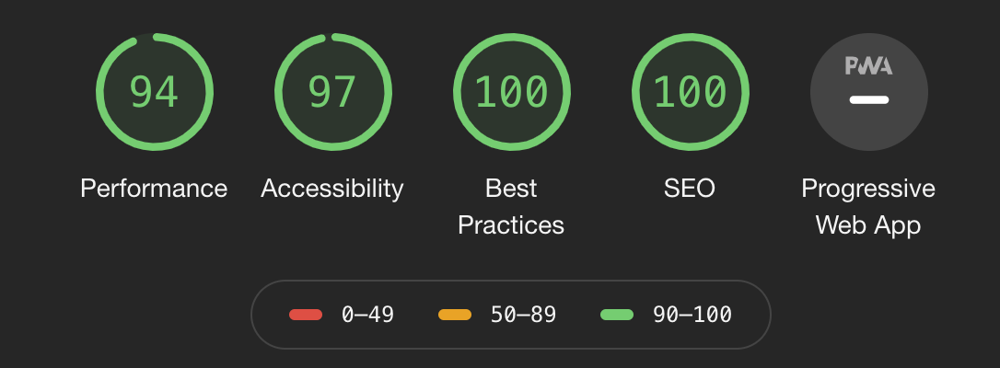
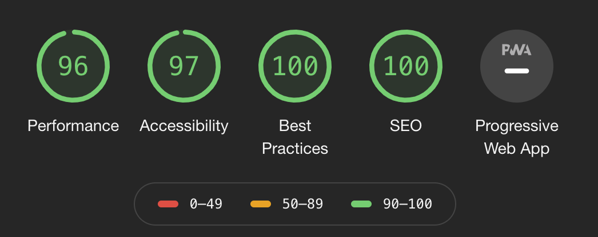
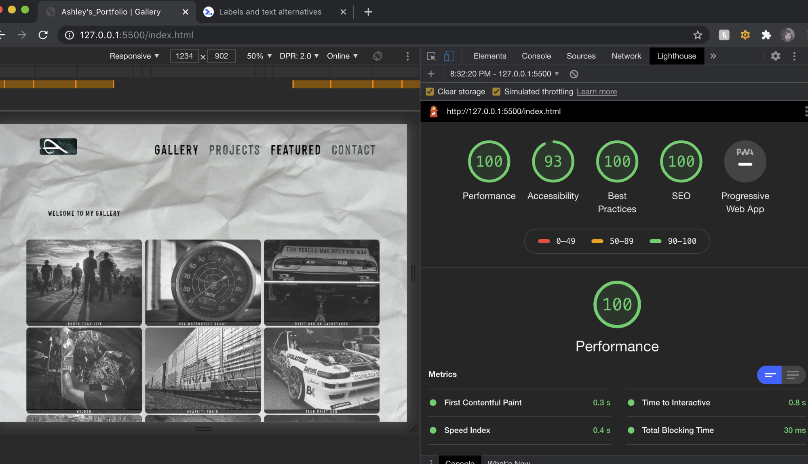
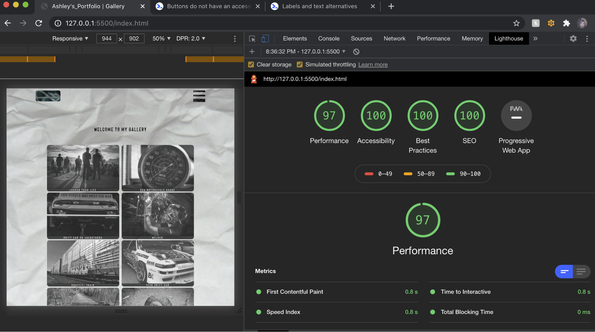

<b>README:</b>
For the Code Louisville project I decided to make an online personal portfolio to sort of compile and showcase images and design work that I have created throughout the years. I had a lot of content already in the form of photographs and vector designs to display on separate pages. One of the biggest challenges I had while working on this project was media queries that target viewport sizes larger than my tiny laptop. I also struggled to figure out what the other navigation links should be as I do not care to explain my work or write about myself- which goes against everything I learned  when obtaining my visual communications degree. I believe that art and visual messages should be interpreted by the viewer and if you have to explain it- then you did not succeed in getting your message across. This site was meant to be a virtual gallery where the user or audience can virtually interact with the artist.

<b>Features:</b>
My project was built with a mobile first approach, starting with a streamlined design for small devices and scaled up using  media queries to alter the layouts for bigger devices.
The changes to layout from mobile to larger devices include a change in navigation from a hamburger menu to a fully displayed navigation bar.
A flexbox direction change from column (for mobile) to row, (for larger viewports) with flex-wrap applied to create an image grid for the gallery & project pages.
The contact/ about page had a shift in layout from a single column to two columns.

<b>(CSS Feature)</b> I implemented flexbox for my “gallery” of images so that my site would be responsive against various viewport sizes.

<b>(JS Feature/ CSS)</b> A hamburger menu that is hidden for larger viewports but is displayed for smaller devices using an if/else JS statement.

<b>(JS Feature)</b> A contact form that uses regular expressions to validate the users input, and then uses that input (the users name) in a message that is displayed after the user clicks the submit button. The message should read: “Thank you (users name) for your valuable feedback!”

<b>(JS Feature)</b> Lightbox displays- larger full image when you click on a thumbnail image. To exit the lightbox just click anywhere outside of the lightbox area.

<b>(JS Feature)</b> The home page displays an object that organizes featured images and other data such as the type of camera used for the shot, the title of the image and the about which is just a short description of the image- that you won't get by looking through the gallery images. The idea was the gallery would host the images. Then if the user wanted to find out more about the image or had any other feedback they could submit it in the contact page. Then those questions would be answered in the featured section which would be updated. 

<b>(CSS Feature)</b> :nth-child & :lastchild was used to style the navigation links. :nth-child was also used for layout of the "about" paragraphs on the featured page.

<b>Project Testing</b>
My project was tested on mac and windows, and runs on Google Chrome, Safari & FireFox. 

<b>Lighthouse Audits</b> 

I ran Lighthouse Audits to see where I could improve, performance, accessibility, Best Practices & Search Engine Optimization.
My first Audit showed me that I needed to improve on my semantics, and to make sure I was following good practices.

My second Audit was looking better, with Best practices but- still I went through to see how I could improve upon performance and accessibility.
I ended up shrinking my images dramatically and changed them from pngs to jpgs and then sent them through an image optimizer to save on file size.

My third audit showed little improvement. But still I kept looking through the report to see where I could improve. 

My fourth audit I started to think that the performance score may also have something to do with network connection.

As these scores were inconsistent each time I generated a new report. I decided to focus on accessibility, Best practices and SEO.  
Below is the last audit done before site submission.

</div